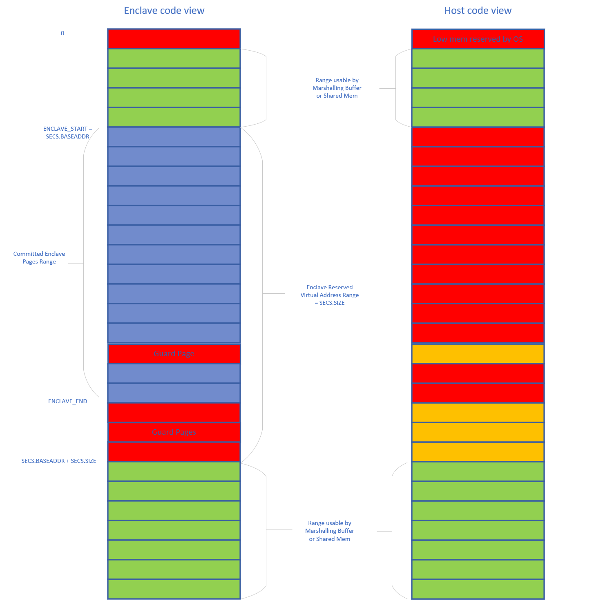
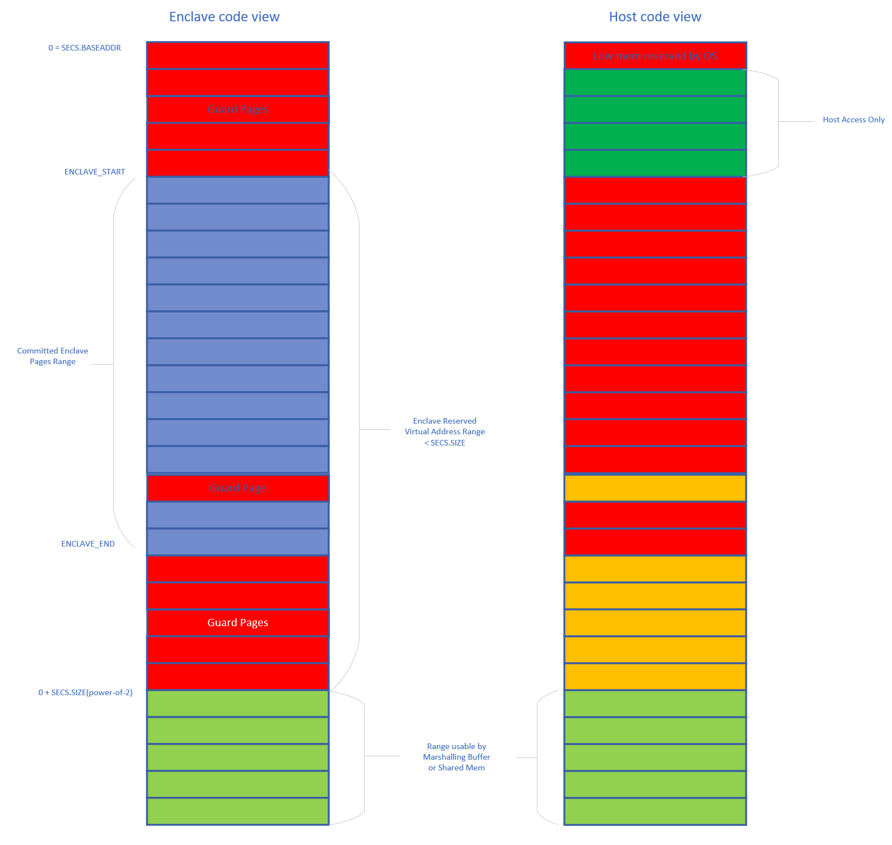

# OE-SGX Enclave Enforcing NULL Pointer Exception

In this paper, we present a design to guarantee Page Fault on NULL point
dereference inside an OE SGX enclave, even if the OS is malicious.

## 0-Page Dereference Expectation

[NullPointerException](https://docs.oracle.com/javase/7/docs/api/java/lang/NullPointerException.html)
or
[NullReferenceException](https://docs.microsoft.com/en-us/dotnet/api/system.nullreferenceexception?view=net-5.0)
are used in certain high level programming languages such as C# and Java, not
just to catch programing mistakes, but also potentially as legit programing
techniques. For example, .NET runtime's JIT logic might generate code that does
not always check for NULL object before accessing the object, instead, relying
on the NullPointerException behavior when 0-page is accessed.

Guaranteed Page Fault on NULL pointer dereference is also the expectation of many
legacy applications.

## SGX Enclave App Memory Layout and NULL Pointer Dereference Behavior

In a typical SGX application, virtual address 0 is not part of the SGX Enclave
linear address range of [`SECS.BASEADDR`, `SECS.BASEADDR` + `SECS.SIZE` -1]. The
typical linear address memory layout of a SGX enclave is shown below. The blue
pages are committed (through EADD or EAUG/EACCEPT instruction) Enclave pages.
The red pages marked as Guard Page(s) are within the Enclave linear address
range, but not committed. If Enclave code attempts to access the Guard Pages,
Page Fault will be triggered, no matter whether the OS Page Table has a valid
entry for those Guard Pages. Guard Pages are used to detect potential stack
overflow. Guard Pages are often present at the end of the enclave linear address
range, because `SECS.SIZE` must be power of 2, and the Enclave's committed pages
quite often will not fill up the full Enclave linear address range. In the
following discussion, the minimum linear address of the committed Enclave pages
is denoted as `ENCLAVE_START` and the linear address right before the
uncommitted pages at the end of the Enclave linear address range is denoted as
`ENCLAVE_END`. An Enclave Loader typically reserves the linear address range
starting from `ENCLAVE_START`, with the size of `SECS.SIZE`, using OS memory
manager APIs, before committing EPC pages to the Enclave.

From the OS and SGX App host side code point of view, any committed Enclave
pages between `ENCLAVE_START` and `ENCLAVE_END` are not accessible, protected by
the SGX CPU. Typically, the collaborative OS or host-side code will not access
any pages within the Enclave linear address range either, as the Enclave loader
reserves that address range for the Enclave. But for specific implementation, if
the OS maps host-side code/data page in the linear address range corresponding
to the Enclave Guard Pages, within the Enclave Linear address range, the
host-side code would be able to access those pages.



The 0-page is typically not accessible. A collaborative OS will not map anything
at the low end of the linear address range around 0. So access to the 0-page, by
Enclave code or by the host-side code, will trigger a Page Fault. But this
behavior relies on OS collaboration. A malicious OS can create a Page Table
entry for the 0-page (virtual address). In that case, enclave code's access to
the 0-page, including dereference virtual address 0, will not trigger a Page
Fault. As a result, NullPointerException or NullReferenceException behavior
inside this type of SGX Enclave cannot be guaranteed within the SGX threat
model.

With the SGX threat model, without guaranteed NULL pointer dereference exception
inside the Enclave, when the OS is potentially malicious, many high level
language runtime would have to be changed to run securely inside the SGX Enclave.

## Guarantee Page Fault on 0-page dereference

If the 0-page is within the SGX Enclave linear address range, and no Enclave EPC
page is committed at address 0, the 0-page becomes an Enclave Guard Page. Even
if a malicious OS creates a Page Table entry for the guard pages, Enclave code
access to the guard pages will always trigger a Page Fault. If the untrusted SGX
Enclave loader EADDs Enclave page to replace the Guard Pages, or does not set
`SECS.BASEADDR` to 0, as expected, the Enclave measurement will be different
from the expected value and the attack will be detected.

To include the 0-page within the SGX Enclave linear address range, SECS.BASEADDR
needs to be set as 0. Effectively, all pages with linear address lower than the
minimum linear address of the committed Enclave pages are guard pages, from the
Enclave code's point of view. Enclave code access to [0, `ENCLAVE_START`-1], or
[`ENCLAVE_END`+1, 0 +`SECS.SIZE`-1], will trigger a Page Fault. Enclave code
access to linear address of `SECS.SIZE` and beyond can success if the OS Page
Table contains a valid entry covering the linear address. For the Enclave code
to access shared memory between the Enclave and the host part of the
application, for example, the ECALL/OCALL data marshalling buffers or host-side
code provided shared memory, those shared memory must reside above `SECS.SIZE`,
not in the address range lower than `ENCLAVE_START`.



In a typical SGX application, `ENCLAVE_START` is selected by the OS memory
manager, and `SECS.BASEADDR` is set to match `ENCLAVE_START`. In SGX, the
committed Enclave page's linear address offset from SECS.BASEADDR is included in
the Enclave measurement. In the case that `SECS.BASEADDR` = `ENCLAVE_START`, the
OS memory manager can place [`ENCLAVE_START`, `ENCLAVE_END`] at different linear
address, and the Enclave measurement will not be affected. With `SECS.BASEADDR`
set to 0, `ENCLAVE_START` must be a predetermined linear address, selected at
Enclave signing time. Both Windows and Linux memory manager APIs support
reserving memory at preferred linear address. Those APIs can be used to support
placing the 0-base SGX Enclave in the memory location required. Typically, the
OS memory manager does not allow reserving address below certain threshold. For
Linux, the threshold is typically 4KB or 64KB, and configurable by the system
admin. For Windows, the threshold is 64KB. Selecting a `ENCLAVE_START` value
much higher than the typical threshold, especially for Linux, makes sure the
enclave can be loaded on most systems.  The Enclave Loader does not need to
reserve the linear address range between `SECS.BASEADDR`=0 and `SECS.SIZE` for
the Enclave. It should reserve the memory range starting from `ENCLAVE_START`,
in this case, predefined at Enclave signing time, with a size smaller than
`SECS.SIZE`.

It's possible to support multiple 0-base Enclaves in a single process. The SGX
CPU does not require each Enclave, even in a single process, to have an unique
Enclave Linear Range, not overlapping with any other Enclaves. The SGX CPU does
enforce that any EPC page must only belong to a single Enclave, the code inside
an Enclave can only access EPC pages belong to itself, and any linear address to
EPC page mapping cannot be changed after the EPC page is added to an Enclave.
With these policies enforced by the SGX CPU, if a malicious OS  manipulates the
Page Table Entries and attempts to circumvent Enclave memory access control or
to trick the code inside an Enclave to access EPC pages belong to another
Enclave, the attack will be detected and blocked. Within any committed page in a
process, a normal-behaving OS only allows a single mapping (between the linear
address and the physical address) for any specific linear address. As a result,
when running multiple Enclaves within a single process, each Enclave must have a
unique, non-overlapping [`ENCLAVE_START`, `ENCLAVE_END`] range (linear address
of each committed EPC pages of an Enclave is within that range), within the
process. For a 0-base Enclave, The linear address range between
`SECS.BASEADDR`=0 and `ENCLAVE_START` does not have any committed EPC page, nor
is reserved by the Enclave Loader. From the OS' point of view, that linear
address range is available for another 0-base Enclave's reserved memory range,
as long as the second enclave's [`ENCLAVE_START`, `ENCLAVE_END`] range can fit
within.  For each 0-base Enclave within a process, the ECALL/OCALL marshalling
buffer and any shared memory an Enclave needs to access must be allocated above
the Enclave's `SECS.SIZE` value.

Running multiple instance of a single 0-base Enclave in a single process won't
be possible, as each instance would has to be loaded at exactly the same
[`ENCLAVE_START`, `ENCLAVE_END`] range to maintain the Enclave measurement,
which is not possible within a single process.

## Support SGX Enclave with SECS.BASEADDR set to 0

To support "0-base" SGX Enclave with `SECS.BASEADDR`=0, an flag indicating
"0-base", and a variable for the predetermined `ENCLAVE_START` value are added
to `oe_sgx_enclave_config` and `_oesgx_load_context`.

```C
typedef struct oe_sgx_enclave_config_t
{
    uint16_t product_id;
    uint16_t security_version;

    /* Flag to indicate 0-base enclave, keeping alignment */
    uint32_t flag_0_base;

    uint8_t family_id[16];
    uint8_t extended_product_id[16];
    /* (OE_SGX_FLAGS_DEBUG | OE_SGX_FLAGS_MODE64BIT | OE_SGX_FLAGS_KSS) */
    uint64_t attributes;

    /* XSave Feature Request Mask */
    uint64_t xfrm;

    /* 0-base enclave start addr */
    uint64_t start_addr;
} oe_sgx_enclave_config_t;

struct _oe_sgx_load_context
{
    oe_sgx_load_type_t type;
    oe_sgx_load_state_t state;

    /* attributes includes:
     *  - OE_FLAG bits to be applied to the enclave, such as debug.
     *  - XFRM supported by the OS to be used in enclave creation.
     */
    sgx_attributes_t attributes;

    /* Fields used when attributes contain OE_FLAG_SIMULATION */
    struct
    {
        /* Base address of enclave */
        void* addr;

        /* Size of enclave in bytes */
        size_t size;
    } sim;

    /* Hash context used to measure enclave as it is loaded */
    oe_sha256_context_t hash_context;

#ifdef OE_WITH_EXPERIMENTAL_EEID
    /* EEID data needed during enclave creation */
    oe_eeid_t* eeid;
#endif

    const oe_config_data_t* config_data;
    bool use_config_id;
    /* If true, the enclave to be loaded is a 0-base enclave */
    bool zero_base_enclave;
    /* 0-base enclave start addr, valid only if zero_base_enclave is true  */
    uint64_t start_addr;
};
```

In `oe_sgx_create_enclave(...)` function, based on `zero_base_enclave` setting
in the `oe_sgx_load_context` input, the function will invoke
`libsgx_enclave_common.so` of the Intel SGX SW stack, which is considered part
of the untrusted SGX Enclave Loader,  to create a regular SGX Enclave or a SGX
Enclave with a fixed base of 0.

When creating an SGX Enclave with a fixed base,  `libsgx_enclave_common.so`
attempts to reserve the virtual memory at the requested `start_addr` and set
`SECS.BASEADDR` as the requested value of 0. If the operations are successful,
the returned enclave start address should match the requested `start_addr`.

With `SECS.BASEADDR` as zero, and the enclave start address not matching
`SECS.BASEADDR`, the enclave EPC page virtual address offset used in `EADD`
instruction should be calculated based on `SECS.BASEADDR`. The offset
calculation for `EADD` instruction is handled in the `libsgx_enclave_common.so`
layer or the SGX driver layer. In the OE SDK, only
`oe_sgx_measure_load_enclave_data(...)` call flow used during enclave signing
needs to be adjusted to address the offset calculation. In the SGX `TCS` page,
several fields are defined as offset value from `SECS.BASEADDR`. OE SDK's
`_add_control_pages(...)` function needs to take into account that 0-base
enclave's `SECS.BASEADDR` is 0, not `start_addr`, when filling in the SGX `TCS`
page.

## Authors

Bo Zhang <zhanb@microsoft.com>.
